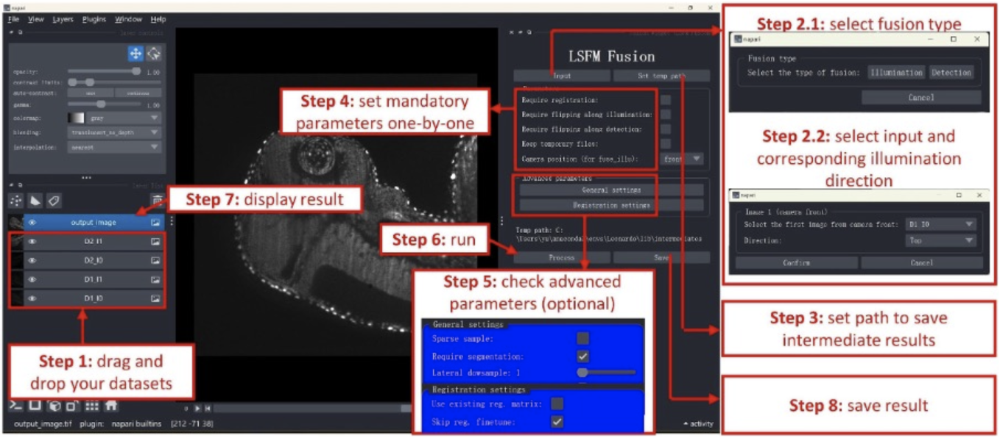

Introduction
============

**Leonardo** is a comprehensive toolbox addressing major sample-induced aberrations in light sheet microscopy. It provides multi-view fusion of opposing illumination and detection sides by leveraging local image quality, specimen geometry, and prior knowledge of sample orientation. 

Leonardo consists of two modules:

- **DeStripe**: Removes the stripe artifacts in SPIM caused by light absorption.
- **FUSE**: Reconstructs one single high-quality image from dual-sided illumination and/or dual-sided detection while eliminating optical distortions (ghosts) caused by light refraction.

Installation
============

You can install **napari-plugin-name** via pip:

.. code-block:: bash

    pip install napari-plugin-name

Alternatively, you can install the latest development version directly from the source:

1. Install Anaconda (or Miniforge or Mambaforge) if you don't have one.
2. Install Git if you don't have it yet.
3. Create a virtual environment with Python <= 3.10 and numpy < 2.0. For example, create an environment called *Leonardo*:

   .. code-block:: bash

      conda create -n Leonardo python=3.10 numpy=1.26.4

4. Activate the environment:

   .. code-block:: bash

      conda activate Leonardo

5. Install FUSE:

   .. code-block:: bash

      pip install git+https://github.com/peng-lab/LSFM-fusion.git
      pip install git+https://github.com/peng-lab/LSFM-fusion.git@8-segmentation-fault-on-mac (for mac M1)

6. Install **napari**:

   .. code-block:: bash

      python -m pip install "napari[all]"

7. Install the **napari FUSE plugin**:

   .. code-block:: bash

      pip install git+https://github.com/peng-lab/LSFM-fusion-napari.git

Getting Started
============

Opening the Plugin by navigating to your napari installation

Launch napari in the terminal:

.. code-block:: bash

  napari

Go to the menu bar and select Plugins > napari-plugin-name.

The plugin interface will appear as a dockable widget within napari.

Running the Plugin
---------------

Load your image or data into napari. You can drag and drop files or use the "File" menu.

Open the plugin as described above.

Use the provided options and settings in the plugin interface to configure your analysis or processing task. See documented image of the GUI. 

