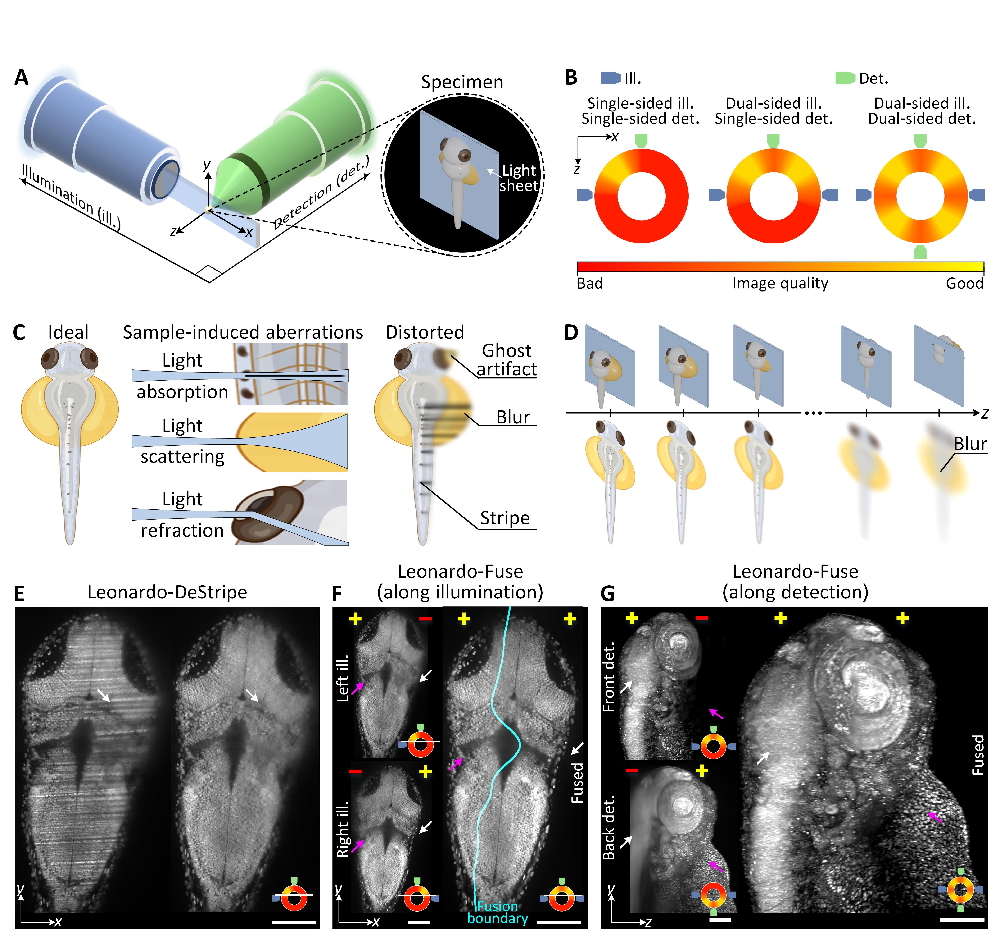

.. leonardo documentation master file, created by
   sphinx-quickstart on Sun Nov 24 16:50:21 2024.
   You can adapt this file completely to your liking, but it should at least
   contain the root `toctree` directive.

|Docs|

Leonardo
=======

**A toolset to remove sample-induced aberrations in light sheet microscopy images**

:mod:`Leonardo` is an AI-empowered image processing toolbox that is able to resolve sample-induced 
aberrations for light-sheet fluorescence microscopy: (1) :mod:`Leonardo-DeStripe` removes the stripe artifacts caused by light absorption; 
(2) :mod:`Leonardo-FUSE` reconstructs one single high-quality image from dual-sided illumination and/or dual-sided detection while 
eliminating optical distortions (ghosts) caused by light refraction.

|
Manuscript
----------

coming soon

.. If you include or rely on Leonardo when publishing research, please cite:

.. .. code-block:: bibtex

..     @article{Bergen2020,
..         title = {Generalizing RNA velocity to transient cell states through dynamical modeling},
..         volume = {38},
..         ISSN = {1546-1696},
..         url = {http://dx.doi.org/10.1038/s41587-020-0591-3},
..         DOI = {10.1038/s41587-020-0591-3},
..         number = {12},
..         journal = {Nature Biotechnology},
..         publisher = {Springer Science and Business Media LLC},
..         author = {Bergen, Volker and Lange, Marius and Peidli, Stefan and Wolf, F. Alexander and Theis, Fabian J.},
..         year = {2020},
..         month = aug,
..         pages = {1408-1414}
..     }
.. Tingying Peng, Yu Liu, Gesine Müller et al. 
.. Leonardo: A Toolset to Remove Sample-Induced Aberrations in Light Sheet Microscopy Images, 
.. 23 January 2025, PREPRINT (Version 1) available at Research Square [https://doi.org/10.21203/rs.3.rs-5853941/v1]

.. toctree::
   :caption: General
   :maxdepth: 2
   :hidden:

   installation
   tutorials
   api

.. |Docs| image:: https://img.shields.io/readthedocs/basicpy
    :target: https://basicpy.readthedocs.io/en/latest/
    :alt: Documentation

